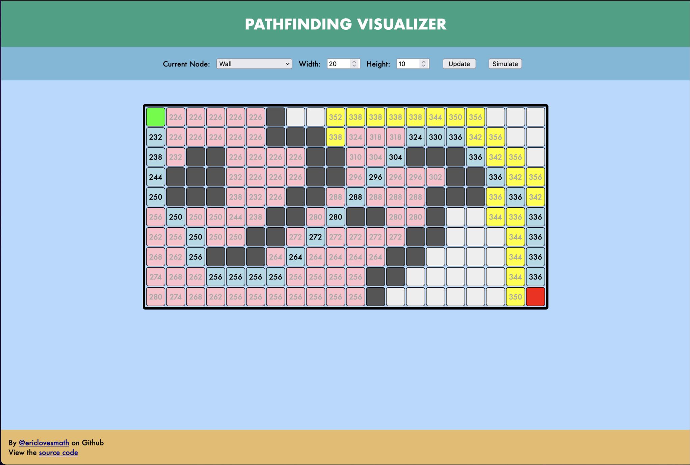

# Pathfinding Visualizer



Pathfinding visualizer in pure HTML/CSS/TS to understand web development!

Live Demo: [https://ericlovesmath.github.io/pathfinding-visualizer/](https://ericlovesmath.github.io/pathfinding-visualizer/)

## Algorithms Implemented

A\* Search: Weighted algorithm, uses heuristics to guarantee the shortest path. Much faster than Dijkstra's Algorithm

*Djikstra's Algorithm*: Working on implementation

## Building and Deploying

```bash
npm install        # Install Dependencies
npm run watch      # Runs `tsc --watch`
npm run dev        # Runs `live-server`

```

## Contributing 

Pull requests are welcome. For major changes, please open an issue first to discuss what you would like to change.

Criticisms of the code base are also welcome, the developer is in the process of learning web development.

## TODO

- A-Star: Remove delays when jumping to non-adjacent node
- Verify functionality for browsers outside of Firefox
- Prevent drawing while simulating or after simulation is complete
- Determine better method of hosting demo
- Work on Djikstra's Algorithm

